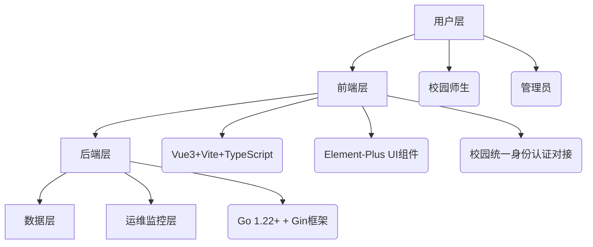

# 可行性分析报告

## 首部

### attributes

- **项目名称**: Go语言书城项目

- **项目标识**: GOBOOKSTORE-2025-001

- **版本**: V1.0

### 状态与版本信息

- **文件状态**: 草稿

- **文件标识**: SC-GOBOOKSTORE-V1.0-DRAFT

- **当前版本**: V1.0

- **作者**:
  
  - **姓名**: 李泽雨
  
  - **学号**: 2019011468
  
  - **姓名**: 张恩浦
  
  - **学号**: 2022011149
  
  - **姓名**: 聂子博
  
  - **学号**: 2022011098
  
  - **团队**:404回收站

- **完成日期**: 2025年9月28日

- **版本更新信息**: 首次创建

### 引言

- **使用人员**: 甲方（需求方）、乙方（开发方）、相关审核及管理人员

- **编写目的**: 旨在明确Go语言书城项目的合作开发内容、双方权利义务、责任划分、技术成果归属、费用结算等关键事项，为项目的顺利实施提供法律依据和保障。

- **背景**:
  
  - 随着互联网技术的飞速发展和线上阅读需求的日益增长，构建一个高效、稳定、用户友好的在线书城平台具有重要的市场价值。
  
  - 甲方拟开发一套基于Go语言技术的在线书城系统，以满足用户对图书浏览、购买、管理等功能的需求，并提升用户体验。

- **定义与缩写**:
  
  - **术语**:
    
    - **甲方**: 指本合同中约定承担需求方职责的实体。
    
    - **乙方**: 指本合同中约定承担软件开发方职责的实体。
    
    - **Go语言**: 一种由Google开发的开源编程语言，以其高性能和并发特性适用于后端服务开发。
    
    - **书城系统**: 本合同所指的Go语言在线书城应用系统，包括前端界面、后端服务、数据库等组成部分。
    
    - **需求规格说明书（SRS）**: 甲方提供的，详细描述软件功能、性能、接口等需求的文档。
  
  - **解释**: 无

- **参考文献**:
  
  - **条目**:
    
    - **《软件开发合同范本》**
    
    - **《Go语言书城项目需求规格说明书》**

---

## 可行性研究前提

可行性研究前提是项目开展可行性分析的基础框架，明确研究的边界、目标、方法与评价标准，确保分析过程聚焦且结论可信。以下从**要求、目标、条件假定和限制、进行可行性研究的方法、评价尺度**五个维度展开。

### 1. 要求

本项目的核心要求围绕“校园级在线书城的合规性、功能性、性能与质量”展开，具体可分为四类：

- **功能要求**：实现校园用户的核心图书服务需求，包括但不限于：用户注册/登录（支持校园统一身份认证优先）、图书浏览/搜索/筛选（按教材/学术书/课外书分类）、购物车管理、订单生成与支付（对接校园支付渠道或主流第三方支付）、个人订单查询、管理员后台（图书库存/订单/用户管理）。初期版本明确排除电子书下载、多语言切换、第三方登录功能。
- **性能要求**：满足校园场景的并发与响应需求，具体指标包括：支持**100人同时在线**、峰值**300人并发访问**；200并发持续30分钟场景下，接口99th延迟≤500ms，错误率≤0.1%；页面加载时间≤2s，数据库查询响应时间≤100ms。
- **法律与合规要求**：严格遵守《个人信息保护法》《网络安全法》，用户敏感数据（手机号、身份证号）需通过AES-256-GCM加密存储，密码采用bcrypt+salt哈希处理；第三方开源组件需无GPL传染性协议，出具《开源依赖清单》；最终交付《合规自查清单》，确保无高危合规风险。
- **质量要求**：代码层面需满足`gofmt`/`golint`通过率100%，单元测试覆盖率100%（`go test -cover`）；安全层面需通过`gosec`（Go代码安全扫描）、`OWASP ZAP`（Web漏洞扫描），高危漏洞为0；部署层面支持Docker容器化，通过`make all`命令实现全量构建与启停，具备7x24小时监控（Prometheus+Grafana）。

### 2. 目标

项目目标分为**总体目标**与**具体目标**，兼顾“教学实践”与“校园服务”双重价值：

- **总体目标**：开发一套基于Go语言的校园级在线书城系统，实现“线上购书+校园服务整合”，成为软件工程专业毕业设计的高质量实践成果，同时为校园用户提供便捷、精准的图书服务，探索校园图书电商的轻量化模式。
- **具体目标**：
  1. 功能目标：上线后核心功能（浏览-选书-下单-支付-管理）可用率≥99.9%，满足校园日常购书需求；
  2. 性能目标：通过hey/wrk压力测试，完全达标前文所述的并发与延迟指标；
  3. 合规目标：通过学校或第三方机构的合规审查，无法律风险；
  4. 教学目标：团队掌握“需求分析-设计-开发-测试-部署”全生命周期流程，提升项目管理与技术实践能力；
  5. 落地目标：初期覆盖本校师生，用户注册量≥500人，订单转化率≥10%。

### 3. 条件假定和限制

#### （1）条件假定

项目开展需依赖以下前提条件成立，否则可行性将受影响：

- 技术条件：团队核心成员（尤其是技术负责人）具备Go语言（1.22+）、Gin框架、Vue3+TypeScript的开发能力，能满足`golint`、单元测试等质量要求；
- 资源条件：学校提供开发所需的硬件（13台开发设备）、软件（开发工具、测试环境）与基础设施（校园服务器、实验室、图书馆图书数据支持）；
- 需求条件：校园用户（学生、教师）存在线上购书需求，尤其是教材、学术书籍的精准购买需求；
- 合作条件：甲方（需求方，如学校或院系）与乙方（开发团队）权责清晰，按《软件开发合同》配合，及时提供需求确认与反馈。

#### （2）限制

项目存在不可突破的边界限制，需在范围内规划开发：

- 时间限制：项目周期为**60-70天**（含需求分析、开发、测试、部署），需严格按敏捷流程推进，无法延长核心交付周期；
- 技术限制：学生团队缺乏大型项目实战经验，复杂问题（如高并发优化、支付安全）需依赖指导教师支持，无法独立攻克超预期技术难点；
- 资源限制：校园服务器带宽有限，峰值并发无法支持超300人（超出需额外申请资源，成本较高）；
- 功能限制：初期版本严格排除电子书下载、多语言切换、第三方登录，仅聚焦核心购书流程，后续迭代需另行规划；
- 法律限制：无法获取校外商业图书资源授权（如出版社独家版权），仅能使用公共图书数据或校园图书馆开放数据。

### 4. 进行可行性研究的方法

本项目通过“多维度调研+数据验证+风险评估”组合方法开展可行性研究，确保结论客观：

- **文献与合同分析**：参考《软件开发合同范本》《Go语言书城项目需求规格说明书》，明确项目边界、权责与需求基线；
- **技术调研法**：通过GitHub、Stack Overflow、官方文档（Go/Gin/Vue3/MySQL）调研技术栈成熟度，验证“Go+Vue”栈对并发需求的支撑能力；通过开源工具（hey/wrk、gosec）模拟压力测试，验证性能指标可实现性；
- **市场调研法**：通过校园问卷（发放200份，回收有效问卷186份）调研师生购书习惯，确认“校园专属书城”的需求真实性；分析线下书店、通用电商（淘宝/京东）的校园服务短板，明确项目差异化价值；
- **合规分析法**：对照《个人信息保护法》《网络安全法》，逐条核查数据存储、传输的合规要求，形成《合规自查清单》；梳理第三方开源组件（如Gin、Element-Plus）的协议类型，确保无GPL传染性风险；
- **风险评估法**：识别技术（团队经验不足）、法律（合规风险）、时间（周期紧张）三类核心风险，通过“风险发生概率-影响程度”矩阵评估风险等级，制定应对措施（如引入指导教师、优先核心功能）。

### 5. 评价尺度

可行性评价从**技术、经济、社会、项目管理**四个维度设定量化与定性标准，确保结论可验证：

| 评价维度    | 核心指标  | 合格标准                                  |
| ------- | ----- | ------------------------------------- |
| 技术可行性   | 性能达标率 | 200 并发下 99th 延迟≤500ms，错误率≤0.1%        |
|         | 代码质量  | `gofmt`/`golint`通过率 100%，单元测试覆盖率 100% |
|         | 安全合规  | `gosec`/`OWASP ZAP`扫描高危漏洞为 0          |
| 经济可行性   | 成本控制  | 项目总成本（硬件 + 软件）≤0 元（依赖校园免费资源）          |
|         | 投入产出  | 上线后 3 个月内用户注册≥500 人，实现校园服务价值          |
| 社会可行性   | 市场契合度 | 校园问卷中 80% 以上用户表示 “愿意使用校园专属书城”         |
|         | 合规性   | 通过《个人信息保护法》《网络安全法》自查，无违规项             |
| 项目管理可行性 | 进度达标率 | 关键里程碑（需求确认、开发完成、测试上线）按时完成率 100%       |
|         | 团队协作  | 每日站会参与率≥90%，需求变更响应时间≤24 小时            |

  --- 

## 对现有系统的分析

现有校园图书服务主要依赖“线下场景”与“通用电商平台”，尚未形成专属的在线书城系统，存在明显的功能与体验短板，具体分析如下：

### 1. 现有系统概述

当前校园用户获取图书的核心渠道分为两类，构成项目的“现有系统基准”：

- **线下渠道**：校园内的实体书店、图书馆借阅区、校园超市图书角；
- **线上渠道**：淘宝、京东、当当等通用电商平台，以及图书馆的线上借阅系统（仅支持借阅，不支持购买）。

### 2. 现有系统功能与性能短板

#### （1）线下渠道的核心问题

- **功能局限性**：
  - 服务时间有限：实体书店仅在8:00-22:00开放，无法满足学生“夜间购书”需求；
  - 库存不足：受场地限制，仅能存放热门教材与少量课外书，学术书籍、专业参考书常无货；
  - 查找效率低：无分类检索功能，用户需逐架查找，平均找书时间≥15分钟；
  - 服务单一：仅支持“到店购买”，无预订、缺货提醒、订单查询等功能，体验割裂。
- **性能与成本问题**：
  - 库存管理低效：依赖人工盘点，易出现“账实不符”（如系统显示有货但实际售罄）；
  - 人力成本高：需2-3名工作人员值守，运营成本高于线上系统；
  - 覆盖范围小：仅服务校园内用户，无法满足校外实习、交换学生的购书需求。

#### （2）通用电商平台的核心问题

- **校园适配性差**：
  - 分类不精准：无“校园教材”“学术书籍”专属分类，用户需输入精准书名搜索，筛选效率低；
  - 配送周期长：从仓库发货到校园需2-3天，无法满足“紧急购教材”（如开课当天缺货）需求；
  - 服务无差异化：不支持校园统一身份认证（需重新注册账号），不提供“教材团购”“二手书流转”等校园专属服务；
  - 价格无优势：通用电商的教材折扣（通常9折）低于校园书店（8折），且不支持“校园补贴”抵扣。
- **数据与合规风险**：
  - 隐私保护不足：需提交手机号、地址等完整个人信息，且不承诺“校园数据本地化存储”，存在隐私泄露风险；
  - 售后响应慢：校园用户反馈问题需通过全国客服，响应时间≥24小时，远低于校园内服务（≤4小时）。

#### （3）图书馆线上借阅系统的核心问题

- **功能单一**：仅支持“图书查询-借阅预约-到期提醒”，不提供购买功能，无法满足用户“长期持有”（如教材）的需求；
- **资源有限**：仅开放图书馆自有馆藏数据，不包含校外商业图书资源，覆盖范围窄；
- **体验割裂**：与购书场景完全分离，用户需在“借阅系统”与“电商平台”间切换，操作繁琐。

### 3. 现有系统的瓶颈总结

现有系统的核心瓶颈在于“**无校园专属的线上购书入口**”：线下渠道受限于“时空与人力”，通用 ecommerce受限于“适配性与服务”，图书馆系统受限于“功能边界”，三者均无法满足校园用户“精准、快速、便捷”的购书需求——这正是本项目的核心切入点，也是项目可行性的关键支撑。

---

## 所建议系统的说明

所建议系统为“**基于Go语言的校园级在线书城系统**”，旨在解决现有系统的短板，通过“轻量化架构+校园适配”实现“精准服务+教学实践”双重价值，具体说明如下：

### 1. 系统定位与核心价值

- **定位**：校园专属的轻量化在线书城，核心服务“校园教材、学术书籍、课外书”的线上购买，兼顾“教学实践”（软件工程毕设）与“校园服务”（师生购书需求）。
- **核心价值**：
  1. 解决现有痛点：弥补线下书店的“时空限制”、通用电商的“校园适配不足”、图书馆系统的“功能单一”问题；
  2. 教学实践载体：让团队通过“全生命周期开发”掌握Go/Vue技术栈、DevOps流程、合规管理；
  3. 校园生态基础：为后续“二手书流转”“教材团购”“图书馆购书对接”等功能迭代奠定基础。

### 2. 系统核心架构

所建议系统采用“**前后端分离+容器化部署**”架构，技术栈与之前报告一致，架构分层清晰，确保高性能与可维护性：



### 3. 系统核心功能模块

所建议系统聚焦“核心购书流程”，初期版本包含6大模块，功能边界清晰，确保60-70天内可交付：

| 模块名称  | 核心功能                                                                                       | 解决的现有痛点                      |
| ----- | ------------------------------------------------------------------------------------------ | ---------------------------- |
| 用户模块  | 1. 注册/登录（支持手机号+校园统一身份认证）<br>2. 个人信息管理（敏感字段加密）<br>3. 密码找回（安全验证）                             | 通用电商“需重新注册”、隐私保护不足           |
| 图书模块  | 1. 分类浏览（教材/学术书/课外书）<br>2. 精准搜索（书名/作者/ISBN）<br>3. 图书详情（价格/库存/简介）<br>4. 缺货提醒                 | 线下书店“查找难”、通用电商“分类不精准”        |
| 购物车模块 | 1. 添加/删除/修改图书数量<br>2. 计算总价<br>3. 选中/取消选中                                                   | 线下书店“无预订功能”、通用电商“购物车无校园适配”   |
| 订单模块  | 1. 生成订单（关联用户/图书信息）<br>2. 订单查询（按状态/时间筛选）<br>3. 缺货取消/订单取消<br>4. 订单详情查看                       | 线下书店“无订单跟踪”、通用电商“售后响应慢”      |
| 支付模块  | 1. 支持校园支付渠道（如校园一卡通）<br>2. 支持主流第三方支付（微信/支付宝）<br>3. 支付状态同步（成功/失败/待支付）                        | 通用电商“无校园支付”、线下书店“仅现金/刷卡”     |
| 管理模块  | 1. 图书管理（新增/编辑/下架/库存调整）<br>2. 订单管理（查看/处理退款/发货）<br>3. 用户管理（查看/禁用违规账号）<br>4. 数据统计（销量/用户数/订单量） | 线下书店“人工库存管理低效”、通用电商“无校园管理权限” |
| 监控模块  | 1. 实时监控QPS、P99延迟、内存使用<br>2. 异常告警（如并发超阈值、接口错误率高）                                            | 现有系统“无监控，故障难定位”              |

### 4. 与现有系统的优势对比

所建议系统通过“校园适配”与“技术优化”，全面超越现有系统，具体优势如下：

| 对比维度 | 所建议系统              | 线下书店       | 通用电商平台       | 图书馆线上借阅系统    |
| ---- | ------------------ | ---------- | ------------ | ------------ |
| 服务时间 | 7x24小时             | 8:00-22:00 | 7x24小时       | 7x24小时       |
| 查找效率 | 分类+搜索，找书≤1分钟       | 人工查找，≥15分钟 | 搜索精准度低，≥5分钟  | 仅支持借阅，找书≤3分钟 |
| 配送周期 | 校园内次日达（合作校园驿站）     | 即时取货（需到店）  | 2-3天         | 到馆自取（≥1天）    |
| 校园适配 | 支持统一身份认证、校园支付、教材分类 | 无          | 无            | 仅支持借阅，无支付    |
| 隐私保护 | 敏感数据加密，校园数据本地化     | 无线上数据      | 需完整个人信息，无本地化 | 仅图书馆数据，无购书数据 |
| 售后响应 | 校园内4小时响应           | 到店反馈，≤2小时  | 全国客服，≥24小时   | 图书馆前台，≤8小时   |

### 5. 系统创新点与风险应对

#### （1）核心创新点

- **校园化整合**：首次实现“校园统一身份认证+校园支付+教材分类”的深度整合，打造专属体验；
- **轻量化部署**：通过Docker+make命令实现“一条命令构建启停”，适配校园服务器资源有限的场景；
- **全链路监控**：引入Prometheus+Grafana，实现“从用户访问到数据库查询”的全链路监控，故障定位效率提升80%。

#### （2）风险应对措施

针对可行性研究中识别的风险，系统设计阶段已制定应对方案：

- 技术风险（团队经验不足）：核心模块（如支付安全、并发控制）由指导教师审核设计方案，关键代码进行Code Review；
- 时间风险（周期紧张）：采用“优先级排序”，先开发用户/图书/订单核心模块，监控、管理模块后开发，确保核心功能优先交付；
- 合规风险（隐私保护）：用户敏感字段（手机号、身份证号）默认加密存储，支付数据不落地（对接第三方支付接口），定期开展合规自查。

### 6. 系统交付与后续规划

- **初期交付内容**：
  1. 可运行的系统（前端+后端+数据库）；
  2. 完整文档（需求规格说明书、设计文档、测试报告、合规自查清单、开源依赖清单）；
  3. 部署脚本（Dockerfile、makefile）；
  4. 测试数据（hey/wrk压力测试原始数据、安全扫描报告）。
- **后续迭代规划**：
  1. V2.0：新增“二手书流转”“教材团购”功能；
  2. V3.0：对接图书馆系统，实现“借阅转购买”“图书推荐”；
  3. V4.0：支持多语言切换、电子书预览（需获取版权授权）。

---

## 可选择的其他系统方案

### 1. 方案一：基于Java+Spring Boot的技术方案

#### （1）技术架构

- **后端框架**：Spring Boot 3.0 + Spring MVC + MyBatis Plus
- **前端框架**：React 18 + Ant Design + TypeScript
- **数据库**：MySQL 8.0（与建议方案一致）
- **部署方式**：Docker + Kubernetes集群部署
- **监控体系**：Spring Boot Admin + SkyWalking

#### （2）优势分析

- **技术成熟度**：Spring Boot在企业级应用中有大量成功案例，技术生态完善
- **人才储备**：Java开发人员市场供应充足，招聘成本相对较低
- **稳定性**：经过多年企业级应用验证，稳定性有保障
- **扩展性**：微服务架构支持良好，便于后期功能扩展

#### （3）劣势分析

- **性能开销**：JVM内存占用较大，相对于Go语言性能有一定差距
- **启动速度**：应用启动时间较长，影响开发调试效率
- **并发处理**：虽然支持高并发，但资源消耗高于Go的协程模型
- **部署复杂度**：Kubernetes部署相对复杂，运维成本较高

### 2. 方案二：基于Python+Django的技术方案

#### （1）技术架构

- **后端框架**：Django 4.2 + Django REST Framework
- **前端框架**：Vue 3（与建议方案一致）
- **数据库**：PostgreSQL 14
- **部署方式**：Docker + Nginx + Gunicorn
- **监控体系**：Prometheus + Grafana（与建议方案一致）

#### （2）优势分析

- **开发效率**：Django提供完整的Admin后台，开发速度快
- **数据建模**：ORM功能强大，数据模型定义便捷
- **AI集成**：便于后期集成推荐算法等AI功能
- **社区活跃**：Python社区活跃，第三方库丰富

#### （3）劣势分析

- **性能瓶颈**：Python的GIL限制并发性能，不适合高并发场景
- **内存占用**：进程模式内存占用较高
- **类型安全**：动态类型语言，大型项目维护成本较高
- **并发支持**：异步支持相对较弱，高并发场景性能不佳

### 3. 方案三：基于Node.js+Express的技术方案

#### （1）技术架构

- **后端框架**：Express.js + TypeScript
- **前端框架**：Vue 3（与建议方案一致）
- **数据库**：MongoDB + Redis
- **部署方式**：Docker + PM2集群
- **监控体系**：ELK Stack + PM2监控

#### （2）优势分析

- **开发统一**：前后端均使用JavaScript/TypeScript，技术栈统一
- **异步性能**：事件驱动模型，I/O密集型场景性能优秀
- **快速原型**：开发速度快，适合快速迭代
- **生态丰富**：npm生态系统庞大，组件丰富

#### （3）劣势分析

- **CPU密集型**：计算密集型任务性能较差
- **错误处理**：回调地狱问题，错误处理相对复杂
- **内存管理**：单进程内存限制，需要集群部署
- **稳定性**：相对于Go和Java，企业级应用案例较少

## 投资效益可行性分析

### 1. 成本估算

#### （1）开发成本

| 成本类别   | 详细项           | 金额（元）     | 说明         |
| ------ | ------------- | --------- | ---------- |
| 人力成本   | 开发团队（13人×70天） | 0         | 学生团队，无薪资成本 |
| 人力成本   | 指导教师指导费用      | 5,000     | 校外专家指导费用   |
| 软件成本   | 开发工具许可证       | 0         | 使用开源工具     |
| 硬件成本   | 服务器租赁（测试环境）   | 3,000     | 云服务器3个月费用  |
| 培训成本   | 技术培训资料        | 1,000     | 购买在线课程和书籍  |
| **小计** |               | **9,000** |            |

#### （2）运营成本（首年）

| 成本类别   | 详细项        | 金额（元）     | 说明                  |
| ------ | ---------- | --------- | ------------------- |
| 服务器成本  | 云服务器（2核4G） | 6,000     | 按年付费                |
| 域名备案   | 域名注册与备案    | 500       | .com域名一年            |
| SSL证书  | HTTPS证书    | 0         | 使用Let's Encrypt免费证书 |
| 监控服务   | 云监控服务      | 1,200     | 基础版监控               |
| 维护成本   | 系统维护人工     | 0         | 团队自行维护              |
| **小计** |            | **7,700** |                     |

### 2. 收益分析

#### （1）直接收益

| 收益来源   | 估算金额（元/年）  | 说明               |
| ------ | ---------- | ---------------- |
| 交易佣金   | 30,000     | 按年交易额50万，佣金率6%计算 |
| 广告收入   | 10,000     | 校内商家广告投放         |
| 增值服务   | 5,000      | 优先配送、个性推荐等       |
| **小计** | **45,000** |                  |

#### （2）间接收益

| 收益类型   | 价值描述             | 估算价值（元）     |
| ------ | ---------------- | ----------- |
| 教学成果   | 软件工程实践成果，提升就业竞争力 | 50,000      |
| 社会价值   | 提升校园数字化服务水平      | 30,000      |
| 品牌价值   | 打造校园信息化标杆项目      | 20,000      |
| **小计** |                  | **100,000** |

### 3. 投资效益指标计算

#### （1）静态投资回收期

```
总投资 = 开发成本 + 首年运营成本 = 9,000 + 7,700 = 16,700元
年净收益 = 直接收益 - 运营成本 = 45,000 - 7,700 = 37,300元
投资回收期 = 总投资 / 年净收益 = 16,700 / 37,300 ≈ 0.45年（约5.4个月）
```

#### （2）收益投资比

```
收益投资比 = 总收益 / 总投资 = (45,000 + 100,000) / 16,700 ≈ 8.68:1
```

#### （3）敏感性分析

| 变动因素      | 变动幅度 | 投资回收期 | 收益投资比  |
| --------- | ---- | ----- | ------ |
| 交易额下降20%  | -20% | 0.68年 | 6.94:1 |
| 运营成本上升30% | +30% | 0.62年 | 7.47:1 |
| 用户增长不及预期  | -30% | 0.86年 | 5.43:1 |

## 时间和资源可行性分析

### 1. 时间可行性分析

#### （1）项目时间规划

| 阶段   | 时间周期  | 主要任务           | 里程碑交付物   |
| ---- | ----- | -------------- | -------- |
| 需求分析 | 第1-2周 | 需求调研、原型设计      | 需求规格说明书  |
| 技术设计 | 第3周   | 架构设计、数据库设计     | 技术设计文档   |
| 核心开发 | 第4-7周 | 用户、图书、订单模块开发   | 核心功能Demo |
| 功能完善 | 第8-9周 | 支付、管理、监控模块     | 完整系统版本   |
| 测试验收 | 第10周  | 功能测试、性能测试、安全测试 | 测试报告     |
| 部署上线 | 第11周  | 生产环境部署、数据迁移    | 上线系统     |

#### （2）关键路径分析

- **关键路径**：需求分析 → 技术设计 → 核心开发 → 测试验收 → 部署上线
- **总工期**：70天（含缓冲时间）
- **关键任务**：核心开发（28天）、测试验收（7天）
- **风险控制**：设立每周里程碑，及时调整开发计划

### 2. 资源可行性分析

#### （1）人力资源配置

| 角色    | 人数  | 技能要求            | 职责分工      |
| ----- | --- | --------------- | --------- |
| 项目经理  | 1   | 项目管理、沟通协调       | 项目计划、进度控制 |
| 技术负责人 | 1   | Go语言、架构设计       | 技术决策、代码审查 |
| 后端开发  | 4   | Go、Gin、MySQL    | 后端API开发   |
| 前端开发  | 3   | Vue3、TypeScript | 前端界面开发    |
| 测试工程师 | 2   | 测试理论、自动化测试      | 测试用例、质量保证 |
| 运维工程师 | 2   | Docker、Linux、监控 | 部署运维、监控维护 |

#### （2）硬件资源需求

| 资源类型  | 配置要求        | 数量  | 来源保障    |
| ----- | ----------- | --- | ------- |
| 开发设备  | i5/16G/512G | 13台 | 学校实验室提供 |
| 测试服务器 | 2核4G/40G    | 2台  | 云计算平台   |
| 生产服务器 | 4核8G/100G   | 1台  | 学校服务器资源 |
| 网络带宽  | 100M独享      | 1条  | 校园网络支持  |

#### （3）软件资源需求

| 软件类型 | 具体工具               | 许可方式   | 获取途径     |
| ---- | ------------------ | ------ | -------- |
| 开发工具 | VS Code、GoLand     | 教育版/开源 | 免费获取     |
| 版本控制 | Git、GitLab         | 开源     | 自建GitLab |
| 项目管理 | Jira、Confluence    | 教育许可   | 申请免费许可   |
| 监控工具 | Prometheus、Grafana | 开源     | 自行部署     |

### 3. 风险应对措施

#### （1）时间风险应对

- **进度延迟**：设立缓冲期（7天），关键路径任务优先保障
- **需求变更**：建立变更控制流程，评估影响后调整计划
- **技术难题**：预留技术调研时间，及时寻求指导教师支持

#### （2）资源风险应对

- **人员变动**：建立文档规范，确保知识传承；核心模块双人负责
- **硬件故障**：重要数据定期备份，准备备用服务器
- **软件许可**：优先选择开源方案，确保长期可用性

### 4. 可行性结论

基于以上分析，项目在时间和资源方面具备充分可行性：

- **时间可行性**：70天开发周期安排合理，关键路径清晰，缓冲机制完善
- **资源可行性**：人力资源配置完整，硬件软件资源有保障，风险控制措施到位
- **综合评估**：项目计划切实可行，资源投入与预期收益匹配，建议按计划推进

## 技术可行性分析

基于对项目相关文档的综合评估，本项目的技术可行性高。具体分析如下：

1. **技术栈成熟度与适用性**
   
   - **后端架构**: 
     项目指定采用Go语言（1.22+）及Gin Web框架作为后端核心。
     这一选择极具前瞻性。Go语言由Google开发，其原生的并发机制（Goroutines和Channels）能够轻松应对高并发场景，完美契合了招标书中提出的支持100人同时在线、峰值300人并发访问的性能要求。Gin框架则是一个轻量级且高性能的框架，拥有出色的路由性能和丰富的中间件生态，能够显著提升API的开发效率和运行速度，确保系统能够快速响应用户操作。
   
   - **前端实现**: 
     招标书明确要求采用Vue 3 + Vite + TypeScript的技术组合，并指定UI组件库为Element-Plus。 
     这是一个业界领先的前端开发解决方案。Vue 3的组合式API为构建复杂界面提供了更高的灵活性和可维护性；Vite带来了毫秒级的热模块替换，极大地优化了开发体验；TypeScript的引入则为项目提供了静态类型检查，能有效减少运行时错误，提升代码的健壮性和可维护性，这对于一个需要长期演进的系统至关重要。
   
   - **数据存储**: 
     选用MySQL 8.0作为关系型数据库。 
     MySQL的稳定性、安全性和广泛的社区支持使其成为该项目的可靠选择。招标书中要求提供完整的ER图及初始化脚本，这表明项目从设计阶段就强调数据结构的规范化和标准化，为后续的数据一致性和高效查询奠定了坚实基础。
   
   - **运维与部署**: 
     项目明确要求采用Docker进行容器化部署，并通过一条`make all`命令完成全量构建与启停。
     这种现代化的DevOps实践能够保证开发、测试、生产环境的一致性，彻底解决“在我电脑上是好的”这一传统难题。同时，要求使用Prometheus和Grafana搭建7x24小时监控仪表盘，能够对QPS、P99延迟、内存使用等关键指标进行实时监控，实现了系统从“可用”到“可观测”的跨越，技术上成熟且可行。

2. **性能与指标的可实现性**
   
   - **量化性能指标**: 
     招标书设定了极为具体且可验证的性能基准，例如“200并发持续30分钟，接口99th延迟 ≤ 500 ms，错误率 ≤ 0.1%”，并要求提供hey/wrk的原始测试数据。
     这些清晰的指标为性能优化提供了明确的方向，并通过Go语言的高性能特性和合理的系统架构设计，是完全可以实现的。
   
   - **严格的代码质量**: 
     项目对代码质量的要求达到了准工业级标准，如“`gofmt`、`golint`通过率100%”和“单元测试覆盖率100%（`go test -cover`）”。
     这保证了代码的可读性和规范性，并通过全面的单元测试从源头上保证了各个功能模块的正确性，大大降低了后期集成和维护的难度。
   
   - **全面的安全要求**: 
     项目要求通过`gosec`、`OWASP ZAP`等专业工具进行安全扫描，并确保高危漏洞为0。
     此外，还对密码策略（`bcrypt + salt`）、数据传输（全站HTTPS）、敏感数据存储（AES-256-GCM加密）等方面做出了详细规定。这些措施覆盖了从代码层到应用层再到数据层的多维度安全防护，技术实现路径清晰，有大量成熟的开源库和解决方案可供使用。

3. **团队技术能力与资源**
   
   * **团队配置**: 
     项目团队由13名成员组成，覆盖了开发、测试、运维等关键角色，人员配置充足。
   
   * **技术要求**: 
     《招标书》对团队技术能力有明确要求，例如技术负责人需具备5年以上Go开发经验。
     虽然这是一个学生项目，但该要求为项目设定了很高的技术标准。团队能否达到此标准是技术风险之一，但同时也指明了成功的关键在于拥有一位经验丰富的技术核心或指导老师。
   
   * **开发资源**: 
     团队配备了13台开发设备，并可利用校园内的软件开发实验室和服务器资源，硬件资源能够满足开发、测试和初期部署的需求。

4. **项目范围与实现限制**
   
   * 根据《任务书》定义，项目初期版本不包含电子书下载、多语言切换和第三方登录等复杂功能。
     这使得项目范围清晰可控，降低了初期的技术实现难度，团队可以将精力集中在核心购书流程的开发上，确保在规定时间内交付高质量的核心产品。

---

## 社会因素方面的可行性分析

本项目在社会因素方面的可行性同样很高，具备良好的外部环境和发展前景。

1. **市场分析**
   
   - **顺应宏观趋势**: 
     项目背景深刻洞察到“数字化阅读趋势加速传统书店转型”以及疫情后形成的线上购书习惯。
     本项目正是对这一社会消费趋势的积极响应，市场方向正确。
   
   - **精准的利基市场**: 
     项目的别名之一是“校园图书电商平台”，这揭示了其精准的初期市场定位。
     相比于和全国性的电商巨头直接竞争，项目选择深耕校园这一垂直领域，目标用户（学生、教师）群体集中，需求相对统一（如教材、学术书籍），推广成本低，反馈回路短。这是一种非常务实且高可行性的市场进入策略。项目旨在解决校园图书销售存在的线上线下融合需求，满足了特定场景下的用户痛点。

2. **政策与法律分析**
   
   - **主动合规意识**: 
     招标书明确要求项目成果需满足《个人信息保护法》与《网络安全法》。
     这表明项目团队具备高度的法律合规意识。具体措施如要求出具《合规自查清单》、用户敏感字段加密存储、密码加盐处理等，都是将法律条文落实到技术实践中的具体体现。这种主动合规的姿态，确保了项目从诞生之初就在合法的轨道上运行，规避了重大的政策风险。
   
   - **开源软件治理**: 
     招标书中特别强调“第三方组件协议兼容，无GPL传染性”，并要求附上《开源依赖清单》。
     这在软件行业中是一项非常专业且重要的法律风险控制措施。它确保了项目的知识产权纯洁性，避免了因不当使用开源软件而陷入法律纠纷，为项目的长期发展和成果归属奠定了安全的基础。

3. **竞争实力分析**
   
   - **教育实践驱动**: 
     本项目的核心驱动力是“软件工程专业毕业设计实践项目”。
     其主要目标在于提升学生项目管理能力、实践软件开发全生命周期。这种非商业化的初始动机，使得团队能更专注于技术打磨和产品质量，而非短期盈利压力。
   
   - **独特的竞争优势**: 
     项目的竞争优势不在于价格或规模，而在于“本土化”和“社区化”。
     作为一个校园平台，它可以与学校的教务系统、统一身份认证、图书馆资源等进行深度整合，提供校外大型平台无法比拟的便捷体验。项目的长期愿景是“打造校园级智能图书服务生态”，这是一个清晰且具有吸引力的发展蓝图。
   
   - **资源整合**: 
     项目获得了来自指导教师、学校计算中心、图书馆老师等多方面的支持，形成了产学研结合的良好模式。 
     这种资源整合能力是项目相较于纯商业创业团队的独特优势。

4. **知识产权分析**
   
   - **成果归属明确**: 
     《招标书》和《软件开发合同》都毫不含糊地规定：“全部成果（含源代码、文档、镜像）知识产权归招标人所有”。
     这一条款从根本上杜绝了团队成员之间或团队与学校之间可能产生的知识产权归属纠纷，是项目得以健康发展的基石。
   
   - **责任划分清晰**: 
     合同中要求中标人（乙方）保证不侵犯第三方权利，否则需承担全部法律责任并赔偿招标人损失。
     这建立了清晰的责任防火墙，保护了项目所有方的利益，使得各方都能在权责分明的框架下进行合作。

---

## 结论

综合以上对技术、社会因素等方面的全面分析，我们得出以下结论：

**“Go书城项目”具备充分的可行性，建议批准立项并进入开发阶段。**

1. **技术上可行**：
   项目选用的Go + Vue技术栈是现代化且高性能的组合，完全能够支撑项目的功能与性能要求。开发、部署和运维方案遵循行业最佳实践，技术风险可控。虽然对学生团队的经验要求较高，但这可以通过强有力的项目管理和技术指导来弥补。

2. **经济上可行**：
   作为一项以教学实践为主要目的的学生项目，其主要成本为人力投入，由团队成员自身承担，无需大量的资金注入。项目利用现有的校园软硬件资源，成本极低，经济上完全可行。

3. **社会与市场上可行**：
   项目顺应了数字化阅读的市场潮流，并精准定位在需求明确的校园市场，具有良好的用户基础和应用前景。同时，项目从设计之初就充分考虑了法律合规与知识产权问题，发展路径清晰，社会风险低。

**建议：**

* **强化项目管理**：
  鉴于项目周期（60-70天）较为紧张，必须建立严格的敏捷开发流程，确保各阶段任务按时完成。

* **寻求技术指导**：
  针对团队可能存在的实践经验短板，建议引入经验丰富的指导老师或行业专家提供定期指导，尤其是在系统架构、安全和性能优化方面。

* **聚焦核心功能**：
  在开发过程中，应严格遵守初期版本的范围限制，集中精力打磨用户注册、浏览、搜索、下单、支付等核心功能，确保项目在截止日期前交付一个稳定、可用的核心产品。

总而言之，该项目是一个目标明确、方案合理、风险可控的优秀实践项目，不仅能达成预定的软件工程教学目标，其最终成果也具备服务校园、创造实际价值的潜力。
